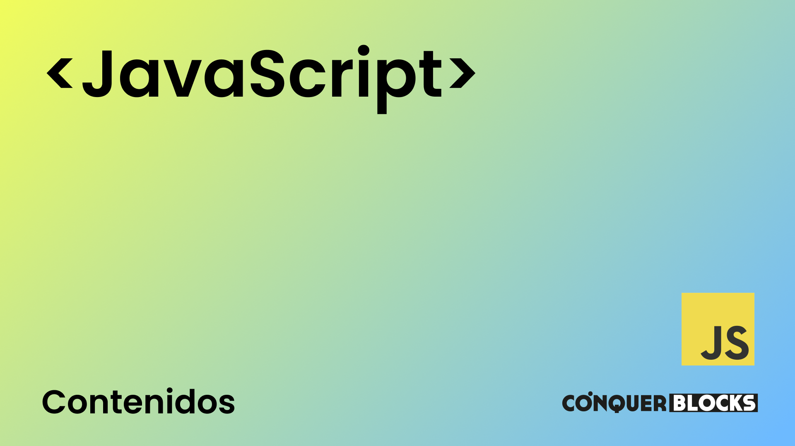

<h1>Máster en Desarrollo FullStack</h1>

<h2>Repositorio creado para el módulo de JS para Máster de Desarrollo FullStack</h2>

<h4>Material de las clases</h4>
<ul>
    <li><a target="_blank" href="https://github.com/bienvenidosaez/conquerblocks-js/blob/master/00_indice_modulo/JS%20-%20Contenidos.pdf">Índice de contenidos del módulo</a></li>
    <li><a target="_blank" href="https://github.com/bienvenidosaez/conquerblocks-js/blob/master/01_clases/Clase%2001%20-%20Introducci%C3%B3n%20a%20JS/JS%20Clase%2001%20-%20Introducci%C3%B3n%20a%20JS.pdf">Clase 01 - Introducción a JS</a></li>
    <li><a target="_blank" href="https://github.com/bienvenidosaez/conquerblocks-js/blob/master/01_clases/Clase%2002%20-%20Conceptos%20b%C3%A1sicos%20del%20lenguaje/Clase%2002%20-%20Conceptos%20b%C3%A1sicos%20del%20lenguaje.pdf">Clase 02 - Conceptos básicos del lenguaje</a></li>
    <li><a target="_blank" href="https://github.com/bienvenidosaez/conquerblocks-js/blob/master/01_clases/Clase%2003%20-%20%20Operadores%20y%20funciones%20en%20Javascript/Clase%2003-%20Operadores%20y%20funciones%20en%20Javascript.pdf">Clase 03 - Operadores y funciones en Javascript</a></li>
    <li><a target="_blank" href="https://github.com/bienvenidosaez/conquerblocks-js/blob/master/01_clases/Clase%2003%20-%20%20Operadores%20y%20funciones%20en%20Javascript/ejercicios/ejercicios-variables.md">Clase 03 - Operadores y funciones en Javascript - Ejercicios</a></li>
</ul>
